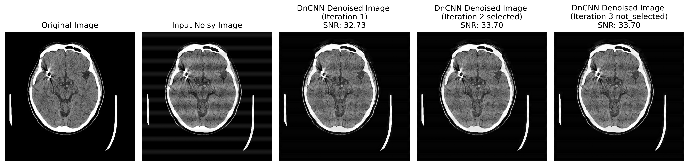
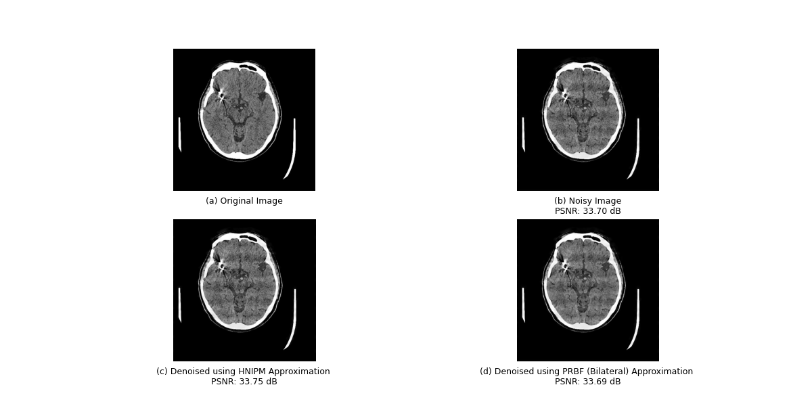
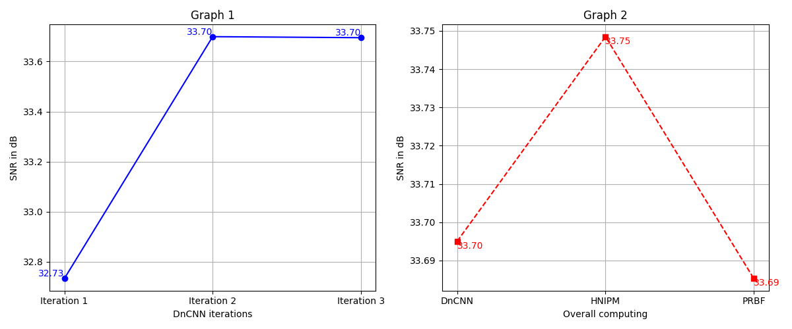

<h1 align='center'>
Welcome to our Final Year project!!!
</h1>

This project contains Denoising of CT images using a hybrid technique of Periodic Denoising and Poisson's Denoising using Denoising Convolutional Neural Network and HNIPM/PRBF algorithms and Interpret the abnormality using ResNet-50 and EfficientNet-B7 algorithms.

All the models are initially trained for Axial CT scan of Human Brain only
The Periodic DnCNN models are well trained with 3 different paramenters able to reduce noise at three different decreasing levels of noise.

The Interpreting Deep-Learning Models are trained with anotated dataset of Aneursym, Cancer, Tumour-Glioma, Tumour-Meningioma, Tumour-Pituitary and Normal Brain 

To run this program you can:
```  
  git clone https://github.com/ckum0507/CT_Denoising_and_intepreting.git
  cd CT_Denoising_and_intepreting
```
Introduce a virtual environment to install libraries:
```
  python  -m venv venv
```
Activating Virtual Environment:
```  
  venv/Scripts/activate # for Windows terminal
  source venv/bin/activate # for bash terminal
```
Installing python library files:
```
  pip install -r cuda-requirements.txt # to work in Dedicated NVidia GPU (requires NVidia GPU driver and CUDA app)
  pip install -r cpu-requirements.txt  # to work in CPU 
```
Running the file:
```
  python app.py
```

After this point, the output folder name will be asked, which will be created withing the **Results** directory, followed by a timestamp.

The noisy image and ideal noiseless images will be acquired by selecting them from a dialog box which will be popping up.

The input images will be processed, and the output images with SNR values and the Interpretation log file will be saved in the designated output directory.

Sample Terminal text observed:
```
PS D:\Documents\Work\CT_Image_Denoising_the_Poissons_and_Periodic_noise_and_Interpretring_using_AI\Denoising> python app.py
Enter the output directory name: (default: output):
Output Directory:  D:\Documents\Work\CT_Image_Denoising_the_Poissons_and_Periodic_noise_and_Interpretring_using_AI\Denoising\Results\output_2025.04.10-23.35.37
Select the image to be denoised...
Select the original image...
The image saved at ouput directory as: Input_noisy_image_30.35.png
The image saved at ouput directory as: Original_image.png

Model train_data/e350-s55 loaded successfully!
The image saved at ouput directory as: DnCNN_denoised_output_Iteration_1_32.73.png

Model train_data/e300-s25_v1 loaded successfully!
The image saved at ouput directory as: DnCNN_denoised_output_Iteration_2_33.70.png

Model train_data/e100-s15 loaded successfully!
The image saved at ouput directory as: DnCNN_denoised_output_Iteration_3_33.70.png
SNR of the output (Iteration 1): 32.73 dB
SNR of the output (Iteration 2): 33.70 dB
SNR of the output (Iteration 3): 33.70 dB
PSNR for DnCNN Periodic Denoising: 33.70 db
PSNR for HNIPM denoising: 33.75 dB
PSNR for PRBF denoising: 33.69 dB


The image saved at ouput directory as: DnCNN_denoised_output_33.70.png
The image saved at ouput directory as: HNIPM_denoised_output_33.75.png
The image saved at ouput directory as: PFBF_denoised_output_33.69.png


DICOM file in output directory as: DnCNN_denoised_output_33.70.dcm
DICOM file in output directory as: Input_noisy_image_30.35.dcm
DICOM file in output directory as: Original_image.dcm
DICOM file in output directory as: HNIPM_denoised_output_33.75.dcm
DICOM file in output directory as: PFBF_denoised_output_33.69.dcm

Inference:
Time take by the DnCNN iteration 1: 0.7432s | SNR value from the Iteration: 32.73 dB
Time take by the DnCNN iteration 2: 0.1144s | SNR value from the Iteration: 33.70 dB
Time take by the DnCNN iteration 3: 0.1887s | SNR value from the Iteration: 33.70 dB
Total time taken by DnCNN: 1.0688s | Best SNR value from the Iterations: 33.70 dB
Time taken by HNIPM: 1.0107s | SNR value from the HNIPM: 33.75 dB
Time taken by PRBF: 0.0175s  | SNR value from the HNIPM: 33.69 dB
Time taken through the best computation: 2.0795s | Best SNR from computation: 33.75 db


ResNet-50 Model Loaded Successfully.
EfficientNet-B7 Model Loaded Successfully.
ResNet-50 Prediction: Aneurysm | Confidence: 99.91% | Time taken: 0.20 sec
EfficientNet-B7 Prediction: Aneurysm | Confidence: 99.83% | Time Taken: 0.09 sec
Interpretation written to D:\Documents\Work\CT_Image_Denoising_the_Poissons_and_Periodic_noise_and_Interpretring_using_AI\Denoising\Results\output_2025.04.10-23.35.37\log.txt
Thank you!!!
```
Sample Output:
<p align='center'>
Comparision of all DnCNN iterations occuring Periodic Denoising
</p>


<p align='center'>
Comparision of all Denoising stages
</p>



The Comparision graph, plotting the SNR value of the image at each step of denoising will also be shown and saved in the output directory.



[Interpretation using AI models](Outputs/Aneurysm_Brain/log.txt)
